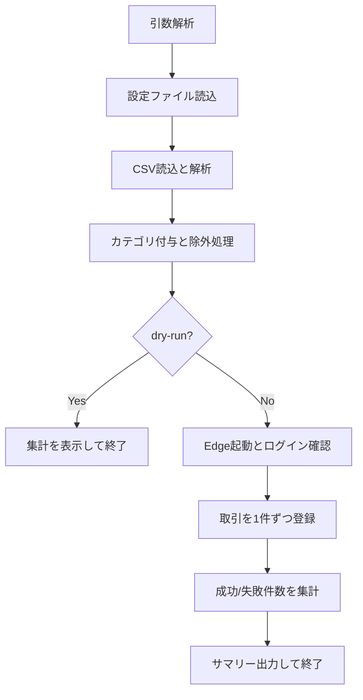

# 設計書

## 概要

### 背景・目的

背景：PayPay 利用明細 CSV を Money Forward ME へ手入力する作業に手間がかかる。

目的：CSV の読み取り、仕訳ルール適用、Money Forward ME への登録を自動化し、登録作業の時間を短縮する。

### 機能一覧

- PayPay の CSV（UTF-8 / UTF-8 BOM）を読み込み、取引データを解析する。
- 取引番号プレフィックス除外とカテゴリマッピングを設定ファイルで制御できる。
- Playwright の persistent profile により、初回ログイン後は再ログインなしで実行できる。
- dry-run モードで登録前に件数確認のみ実行できる。
- 登録失敗時にスクリーンショットを保存できる。

## 入力

### コマンドライン引数

| 引数 | 必須 | 説明 |
| ---- | ---- | ---- |
| `--csv=<path>` | 必須 | PayPay CSV ファイルパス |
| `--config=<path>` | 任意 | 設定 JSON ファイルパス（既定値: config.json） |
| --headless | 任意 | Edge をヘッドレスで起動 |
| --dry-run | 任意 | 解析とフィルタのみ実行し、MF へ登録しない |
| --keep-open | 任意 | 終了時にブラウザーを閉じず Enter 待ちする（headed 時のみ） |

補足：--csv が未指定の場合は終了コード 1 で終了する。

### ファイル（JSON 設定）

| 項目 | 内容 |
| ---- | ---- |
| テンプレート | config_sample.json |
| ユーザー設定ファイル名 | config.json（任意のパス指定も可） |
| 形式 | JSON |
| エンコーディング | UTF-8 / UTF-8 BOM |

主要キー:

| キー名 | データ型 | 説明 |
| ---- | ---- | ---- |
| mfAccount | string | Money Forward 側の対象口座名 |
| excludePrefixes | string[] | 取引番号プレフィックス一致で除外 |
| mappingRules | object[] | 取引先キーワードによるカテゴリ割り当て |
| categoryMap | object | 中カテゴリ名 -> 大カテゴリ名の対応 |
| advanced.screenshotOnError | boolean | 登録失敗時にスクリーンショット保存 |

```json
{
    "mfAccount": "PayPay",
    "excludePrefixes": ["PPCD_A_"],
    "mappingRules": [
        {
            "keyword": "Seven",
            "category": "Food",
            "matchMode": "contains",
            "direction": "expense",
            "priority": 100
        }
    ],
    "categoryMap": {
        "Food": "Living"
    },
    "advanced": {
        "screenshotOnError": true
    }
}
```

### ファイル（CSV）

| 項目 | 内容 |
| ---- | ---- |
| 形式 | CSV |
| エンコーディング | UTF-8 / UTF-8 BOM |
| ヘッダー | 必須 |

主要列（PayPay CSV）:

| 列名 | 説明 |
| ---- | ---- |
| 取引日 | 日時（yyyy/MM/dd HH:mm:ss） |
| 取引先 | メモ生成とルール判定に使用 |
| 出金金額（円） | 支出金額 |
| 入金金額（円） | 収入金額 |
| 取引内容 | 取引内容テキスト |
| 取引番号 | 除外判定に使用 |
| 海外出金金額 | メモ補足情報 |
| 通貨 | メモ補足情報 |

## 出力

### 標準出力

通常実行時は、登録結果サマリーを標準出力へ表示する。

- success: 登録成功件数
- failed: 登録失敗件数
- skipped: 除外などでスキップされた件数
- parse_failures: CSV 解析失敗件数

dry-run 時は、以下の集計のみを表示する。

- total
- parse_failures
- excluded
- target

### 生成ファイル

| パス | 説明 |
| ---- | ---- |
| .paypay2mf-profile/ | Playwright persistent profile（ログインセッション保持） |
| artifacts/ | 登録失敗時のスクリーンショット保存先 |

## 実行方法

### セットアップ

```bash
npm install
npx playwright install
```

### 初回ログイン（重要）

1. 初回は --headless を付けずに実行する。
2. ブラウザーが .paypay2mf-profile を使って起動する。
3. 表示されたブラウザーで Money Forward に手動ログインする。
4. 家計簿画面が表示されたら、ターミナルで Enter を押す。
5. 2 回目以降は保存済みプロファイルを再利用し、ログインをスキップする。

補足：初回を --headless で実行すると手動ログインできないためエラー終了する。

### コマンド例

```bash
npm run import:paypay -- --csv="C:\\path\\paypay.csv"
npm run import:paypay -- --csv="C:\\path\\paypay.csv" --dry-run
npm run import:paypay -- --csv="C:\\path\\paypay.csv" --headless
npm run import:paypay -- --csv="C:\\path\\paypay.csv" --config="C:\\path\\config.json"
```

## 想定実行環境

| 項目 | 内容 |
| ---- | ---- |
| OS | Windows 10 / Windows 11 |
| Node.js | 18 以上 |
| ブラウザー | Microsoft Edge（stable） |
| 主要ライブラリー | playwright |

## 処理詳細

1. コマンドライン引数を解析する。
2. 設定 JSON と UI セレクター設定を読み込む。
3. CSV を読み込み、行単位で解析して取引データを生成する。
4. ルールに基づきカテゴリを付与し、プレフィックス除外を適用する。
5. dry-run 指定時は集計のみ出力して終了する。
6. ブラウザーを起動し、必要に応じてログイン完了を待つ。
7. 対象取引を 1 件ずつ Money Forward 手入力画面へ登録する。
8. 実行サマリーを出力し、ブラウザーコンテキストを終了する。



## ログ出力

### ログ出力概要

| 項目 | 内容 |
| ---- | ---- |
| 出力先 | 標準出力 / 標準エラー |
| 形式 | プレーンテキスト |
| ログファイル | なし（アプリケーションでファイルローテーションは行わない） |

### 主な出力メッセージ例

```text
dry-run mode
total=120
parse_failures=2
excluded=15
target=103

success=100
failed=3
skipped=17
parse_failures=2

[record-failed] row=23 merchant=Example Store error=account not found in MF dropdown: PayPay
[artifact] screenshot=C:\path\to\artifacts\failed-row-23-XXXXXXXX.png
```

## ライセンス

### 本プログラムのライセンス

MIT License。

### 使用ライブラリー

| ライブラリー名 | 用途 |
| ---- | ---- |
| playwright | ブラウザー自動操作 |

## 開発詳細

### 開発環境

| 項目 | 内容 |
| ---- | ---- |
| 言語 | JavaScript（Node.js） |
| ランタイム | Node.js 18+ |
| 自動化基盤 | Playwright |
| 対象ブラウザー | Microsoft Edge |

### プロジェクト構成（主要ファイル）

| ファイル | 説明 |
| ---- | ---- |
| src/import-paypay-to-mfme.js | エントリポイントおよび処理本体 |
| src/mfme.config.json | Money Forward UI セレクター・タイムアウト設定 |
| config_sample.json | ユーザー設定サンプル |

## 改訂履歴

| バージョン | 日付 | 内容 |
| ----- | ---------- | -------------- |
| 1.0.0 | 2026-05-06 | 初版作成 |
