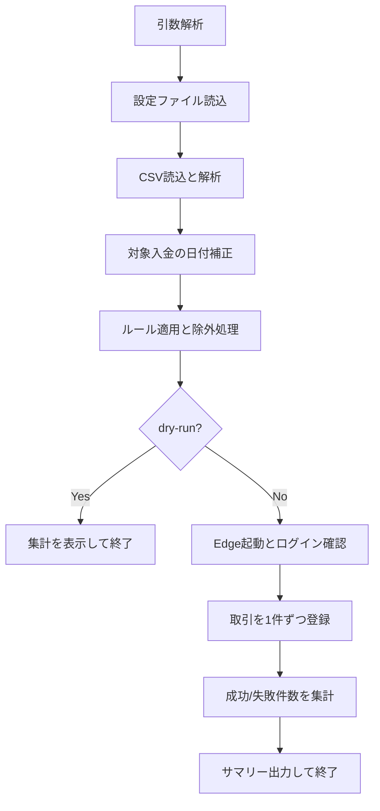

# 設計書

## 概要

### 背景・目的

背景：PayPay 利用明細 CSV を Money Forward ME へ手入力する負担が大きい。

目的：CSV の読み取り、仕訳ルール適用、Money Forward ME への登録を自動化し、登録に要する時間を短縮する。

### 機能一覧

- PayPay の CSV（UTF-8 / UTF-8 BOM）を読み込み、取引データを解析する。
- 取引番号プレフィックス除外とカテゴリマッピングを設定ファイルで制御できる。
- 同じルール配列で、カテゴリ登録と振替登録の両方を制御できる。
- 特定の入金は固定業務ルールに基づき、Money Forward 登録日を 30 日後へ補正する。
- Playwright の persistent profile により、初回ログイン後は再ログインなしで実行できる。
- dry-run モードで登録前に件数確認のみ実行できる。
- 登録失敗時にスクリーンショットを保存できる。

## 入力

### コマンドライン引数

| 引数 | 必須 | 説明 |
| ---- | ---- | ---- |
| `--csv=<path>` | 必須 | PayPay CSV ファイルパス |
| `--config=<path>` | 任意 | 設定 JSON ファイルパス（既定値: config.json） |
| --headless | 任意 | Edge をヘッドレスモードで起動する |
| --dry-run | 任意 | 解析とフィルタのみ実行し、MF へ登録しない |
| --keep-open | 任意 | 終了時にブラウザーを閉じず Enter を待つ（headed 時のみ） |

補足：--csv が未指定の場合は終了コード 1 を返す。

### ファイル（JSON 設定）

| 項目 | 内容 |
| ---- | ---- |
| テンプレート | config_sample.json |
| ユーザー設定ファイル名 | config.json（任意のパス指定も可） |
| 形式 | JSON |
| エンコーディング | UTF-8 / UTF-8 BOM |

主要キー:

| キー名 | データ型 | 説明 |
| ---- | ---- | ---- |
| mfAccount | string | Money Forward 側の対象口座名 |
| excludePrefixes | string[] | 取引番号プレフィックス一致で除外 |
| mappingRules | object[] | 取引先キーワードによるカテゴリ割り当て、または振替登録ルール |
| categoryMap | object | 中カテゴリ名 -> 大カテゴリ名の対応 |
| duplicateDetection.backend | string | `local` または `gcloud` |
| duplicateDetection.databaseId | string | Firestore DB ID（gcloud 使用時。既定値 `(default)`） |
| duplicateDetection.localStorePath | string | local バックエンドの履歴 JSON パス。相対パスは config.json のあるディレクトリ基準（既定値 `logs/processed.json`） |
| gcloudCredentialsPath | string | gcloud サービスアカウント JSON パス（gcloud 使用時に必須）。相対パスは config.json のあるディレクトリ基準 |
| advanced.screenshotOnError | boolean | 登録失敗時にスクリーンショット保存 |

`mappingRules` の正式スキーマ:

| キー名 | データ型 | 必須 | 説明 |
| ---- | ---- | ---- | ---- |
| keyword | string | 必須 | `取引先` に対する照合文字列 |
| matchMode | string | 任意 | `contains`、`starts_with`、`regex`。既定値は `contains` |
| direction | string | 任意 | `expense`、`income`、`any`。既定値は `any` |
| priority | number | 任意 | 数値が大きいルールを優先 |
| category | string | 条件付き | 通常のカテゴリ登録ルールで使う中カテゴリ名 |
| isTransfer | boolean | 条件付き | `true` の場合はカテゴリ登録ではなく振替登録として扱う |
| transferAccount | string | 条件付き | 振替相手の口座名。`isTransfer=true` の場合に必須 |

補足:

- `category` を指定したルールは、通常の入出金カテゴリ登録として扱う。
- `isTransfer=true` のルールは、カテゴリ登録ではなく振替登録として扱う。
- `category` と `isTransfer=true` は同時指定しない。
- 同一取引に複数ルールが一致した場合は、`priority` の高い順で評価する。
- `priority` が同じ場合は、`mappingRules` の記述順（上から）を優先する。
- `direction=expense` の振替ルールは、PayPay を振替元、`transferAccount` を振替先として登録する。
- `direction=income` の振替ルールは、`transferAccount` を振替元、PayPay を振替先として登録する。
- `transferAccount` は Money Forward ME の振替元・振替先候補に表示される口座名と一致させる。

補足:

- 設定ファイルに日付補正用の追加キーは不要。
- 入金かつ `取引内容=ポイント、残高の獲得`、
    `取引方法=PayPayポイント` で、`取引先` が `ワイモバイル` と
    `Yahoo!ズバトク` 以外の場合、Money Forward へは 30 日後の日付に
    補正して登録する。
- 重複検知に使用する重複指紋は、補正後日付ではなく入力 CSV の `取引日` をそのまま使う。

#### パス解決について

`duplicateDetection.localStorePath` と `gcloudCredentialsPath` に相対パスを
指定した場合、その解決基準は config.json のあるディレクトリです。
例えば、config.json が `/workspace/config.json` の場合：

- `logs/processed.json` → `/workspace/logs/processed.json`
- `./secrets/paypay2mf-credentials.json` → `/workspace/secrets/paypay2mf-credentials.json`
- `/tmp/processed.json` （絶対パス） → `/tmp/processed.json` （そのまま使用）

```json
{
    "mfAccount": "PayPay",
    "excludePrefixes": ["PPCD_A_"],
    "mappingRules": [
        {
            "keyword": "Seven",
            "category": "Food",
            "matchMode": "contains",
            "direction": "expense",
            "priority": 100
        },
        {
            "keyword": "PayPayポイント運用",
            "isTransfer": true,
            "transferAccount": "PayPayポイント",
            "matchMode": "contains",
            "direction": "expense",
            "priority": 400
        }
    ],
    "categoryMap": {
        "Food": "Living"
    },
    "duplicateDetection": {
        "backend": "local",
        "databaseId": "(default)",
        "localStorePath": "logs/processed.json"
    },
    "gcloudCredentialsPath": "./secrets/paypay2mf-credentials.json",
    "advanced": {
        "screenshotOnError": true
    }
}
```

振替ルール例:

- `PayPayポイント運用` の出金を、PayPay から `PayPayポイント` への振替として登録する。
- 同じキーワードの入金を逆方向の振替として扱いたい場合は、`direction` を `income` にした別ルールを追加する。

### ファイル（CSV）

| 項目 | 内容 |
| ---- | ---- |
| 形式 | CSV |
| エンコーディング | UTF-8 / UTF-8 BOM |
| ヘッダー | 必須 |

主要列（PayPay CSV）:

| 列名 | 説明 |
| ---- | ---- |
| 取引日 | 日時（yyyy/MM/dd HH:mm:ss） |
| 取引先 | メモ生成とルール判定に使用 |
| 出金金額（円） | 支出金額 |
| 入金金額（円） | 収入金額 |
| 取引内容 | 取引内容テキスト |
| 取引番号 | 除外判定に使用 |
| 取引方法 | 重複判定の入力項目 |
| 支払い区分 | 重複判定の入力項目 |
| 利用者 | 重複判定の入力項目 |
| 海外出金金額 | メモ補足情報 |
| 通貨 | メモ補足情報 |

補足:

- `取引日` は重複指紋の入力値として、入力 CSV の値をそのまま使用する。
- 上記の固定条件に一致する入金のみ、Money Forward への登録時に 30 日後の日付へ補正する。

## 出力

### 標準出力

通常実行時は、登録結果サマリーを標準出力へ表示する。

- 成功: 登録成功件数
- 失敗: 登録失敗件数
- スキップ: 除外などでスキップされた件数
- 除外: プレフィックス除外件数
- 重複: 重複検知でスキップした件数
- 解析失敗: CSV 解析失敗件数

dry-run 時は、以下の集計のみを表示する。

- 合計
- 解析失敗
- 除外
- 重複
- 対象

### 生成ファイル

| パス | 説明 |
| ---- | ---- |
| .paypay2mf-profile/ | Playwright persistent profile（ログインセッション保持） |
| artifacts/ | 登録失敗時のスクリーンショット保存先 |
| logs/processed.json | local バックエンドの重複履歴（`row_fingerprints` 配列） |

## 実行方法

### セットアップ

```bash
npm ci
npx playwright install
```

### 初回ログイン（重要）

1. 初回は --headless を付けずに実行する。
2. ブラウザーが .paypay2mf-profile を使って起動する。
3. 表示されたブラウザーで Money Forward に手動ログインする。
4. 家計簿画面が表示されたら、ターミナルで Enter を押す。
5. 2 回目以降は保存済みプロファイルを再利用し、ログインをスキップする。

補足：初回を --headless で実行すると手動ログインできないため、エラーで終了する。

### コマンド例

```bash
node src/import-paypay-to-mfme.js --csv="C:\\path\\paypay.csv"
node src/import-paypay-to-mfme.js --csv="C:\\path\\paypay.csv" --dry-run
node src/import-paypay-to-mfme.js --csv="C:\\path\\paypay.csv" --headless
node src/import-paypay-to-mfme.js --csv="C:\\path\\paypay.csv" --config="C:\\path\\config.json"
npm run smoke:dry-run
```

## 想定実行環境

| 項目 | 内容 |
| ---- | ---- |
| OS | Windows 10 / Windows 11 |
| Node.js | 20 以上 |
| ブラウザー | Microsoft Edge（stable、最新版推奨） |
| ライブラリー | playwright 1.59.1 以上、@google-cloud/firestore 8.5.0 以上 |

## 処理詳細

1. コマンドライン引数を解析する。
2. 設定 JSON と UI セレクター設定を読み込む。
3. CSV を読み込み、行単位で解析して取引データを生成する。
4. 条件一致する特定の入金だけ、登録用日付を 30 日後へ補正する。
5. ルールに基づきカテゴリを付与し、プレフィックス除外と重複検知を適用する。
6. 振替ルールに一致した取引は、カテゴリの代わりに振替元・振替先を決定する。
7. 重複指紋は入力 CSV の `取引日` を使って判定し、補正後日付へは切り替えない。
8. dry-run 指定時は集計のみ出力して終了する（履歴更新なし）。
9. ブラウザーを起動し、必要に応じてログイン完了を待つ。
10. 対象取引を 1 件ずつ Money Forward 手入力画面へ登録する。
11. 通常ルールは口座とカテゴリを入力し、振替ルールは同一モーダルの振替タブで振替元・振替先を入力する。
12. 登録成功後に重複履歴を更新する。
13. 実行サマリーを出力し、ブラウザーコンテキストを終了する。



## ログ出力

### ログ出力概要

| 項目 | 内容 |
| ---- | ---- |
| 出力先 | 標準出力 / 標準エラー |
| 形式 | プレーンテキスト |
| ログファイル | なし（アプリケーションでファイルローテーションは行わない） |

### 主な出力メッセージ例

```text
ドライランモード
合計=120
解析失敗=2
除外=15
重複=7
対象=96

成功=100
失敗=3
スキップ=24
除外=15
重複=9
解析失敗=2

[登録失敗] 行=23 取引先=Example Store エラー=Money Forwardの口座選択に指定口座が見つかりません: PayPay
[成果物] スクリーンショット=C:\path\to\artifacts\failed-row-23-XXXXXXXX.png
```

## ライセンス

### 本プログラムのライセンス

MIT License

### 使用ライブラリーのライセンス

| ライブラリー名 | バージョン | ライセンス |
| ---- | ---- | ---- |
| playwright | 1.55.0 以上 | Apache-2.0 |
| @google-cloud/firestore | 8.5.0 以上 | Apache-2.0 |

## 開発詳細

### 開発環境

| 項目 | 内容 |
| ---- | ---- |
| OS | Microsoft Windows 11 Home 10.0.26200 |
| ランタイム | Node.js v24.12.0 |
| 自動化基盤 | Playwright 1.59.1 |
| 対象ブラウザー | Microsoft Edge 147.0.3912.98 |
| エディター | Visual Studio Code 1.119.0 |

### プロジェクト構成（主要ファイル）

| ファイル | 説明 |
| ---- | ---- |
| src/import-paypay-to-mfme.js | CLI エントリポイント（起動・画面操作・実行制御） |
| src/import-core.js | CSV解析・変換・フィルタなどの純粋ロジック |
| src/duplicate-detector.js | 重複検知（local / gcloud バックエンド） |
| src/mfme.config.json | Money Forward UI セレクター・タイムアウト設定 |
| config_sample.json | ユーザー設定サンプル |

### 検証コマンド

```bash
npm ci
npm test
npm run lint:md
npm run compare:fingerprint:python
npm run test:gcloud:e2e
npm run smoke:dry-run
```

## 改訂履歴

| バージョン | 日付 | 内容 |
| ----- | ---------- | -------------- |
| 1.0.0 | 2026-05-06 | 初版作成 |
